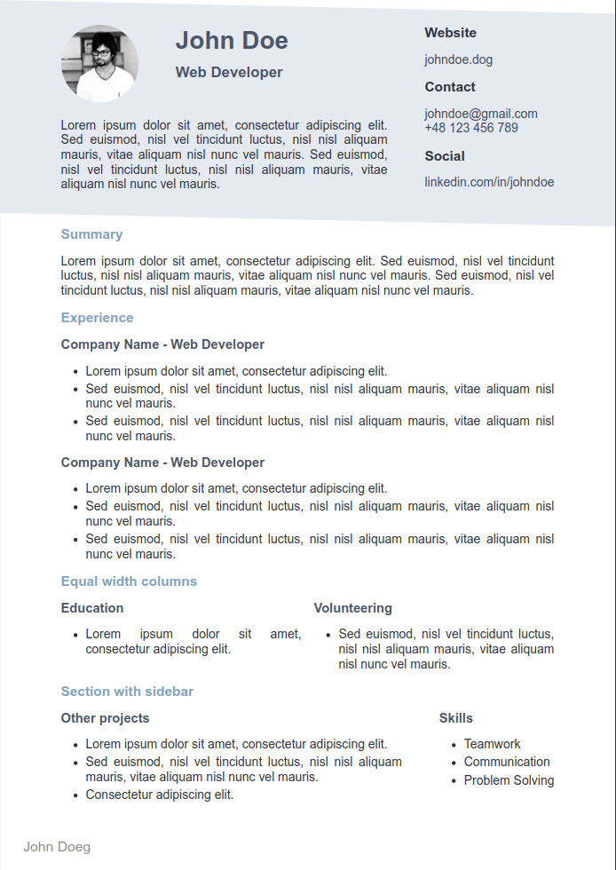

# marp-markdown-resume

## Template for creating resumes in Markdown with marp-cli



### Setup

Install dependencies (make sure you have [actively supported version](https://endoflife.date/nodejs) of `node`installed, in this case version 14 or higher is required):

```bash
make install
```

This installs `marp-cli` package locally. You can skip this step if you already have `marp-cli` installed globally.

To install `marp-cli` globally, run:

```bash
npm install -g @marp-team/marp-cli1
```

### Usage

Edit `resume.md` and fill it with your data. Optionally you can tweak `resume.css` to change the look of your resume.

Current stylesheet contains basic utilities for sections, headings, and columns. `resume.css` contains some variables that you can change to customize the look of your resume. Or you can just write your own styles.

Refer to [marp documentation](https://marpit.marp.app/) for more information.

### Generating resume

Generate resume in PDF format:

```bash
make pdf
```

Generate resume in HTML format:

```bash
make html
```
